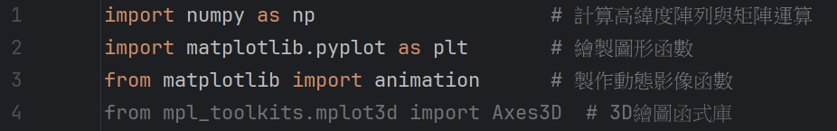
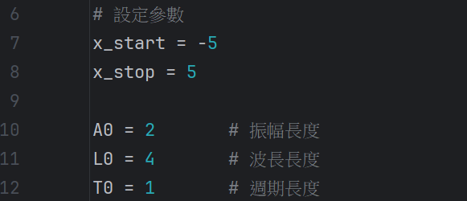
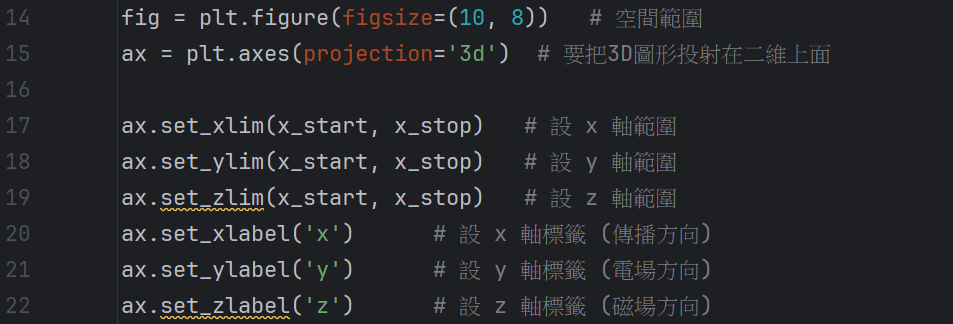
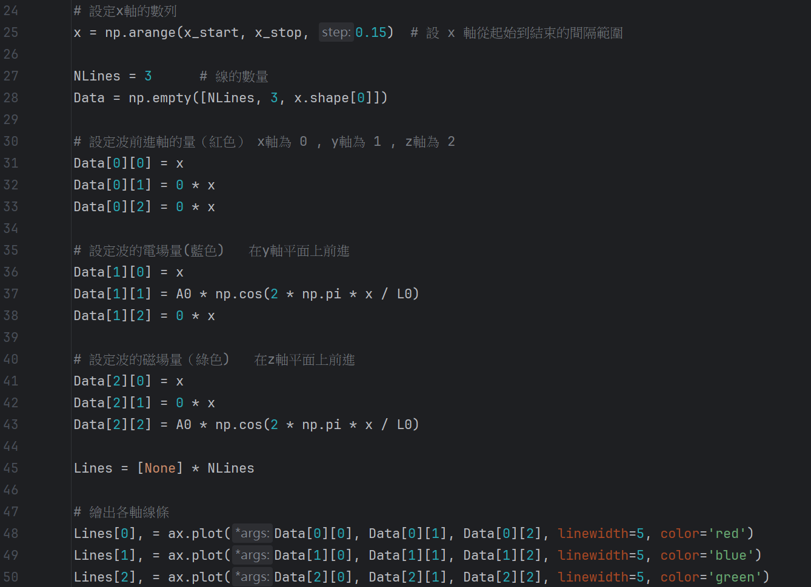
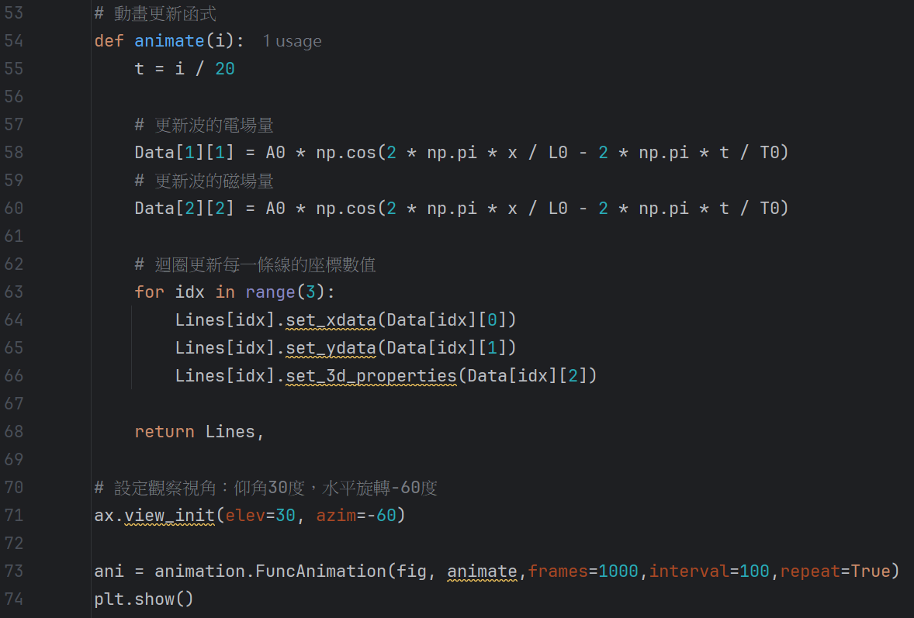

# 輔仁大學理工轉學考作品：3D電磁波動態視覺化 

## 📝 作品簡介 
本專案利用 Python 進行電磁波之數值模擬，驗證電場 (E-field) 與磁場 (B-field) 在三維空間中之正交特性。

## 📊 執行成果展示 

## 🛠 執行環境需求 
本專案於 Python 環境下開發，執行前請確保已安裝相關套件： pip install numpy matplotlib

## 💻 核心原始碼 (Source Code) 
💡 教授您好，以下為本專案之核心3D電磁波動態的完整程式碼：

[1] 函式庫載入 (Imports) 

[2] 參數設定 (Parameters) 

[3] 3D 場景建構 (Setup) 

[4] 物理模型建立 (Modeling) 

[5] 動態渲染與執行 (Animation) 

# 📝設計心得: 
透過這次模擬，我深入理解了電磁波在三維空間中 E-field 與 B-field 相互耦合的物理機制，並成功將其動態視覺化。
